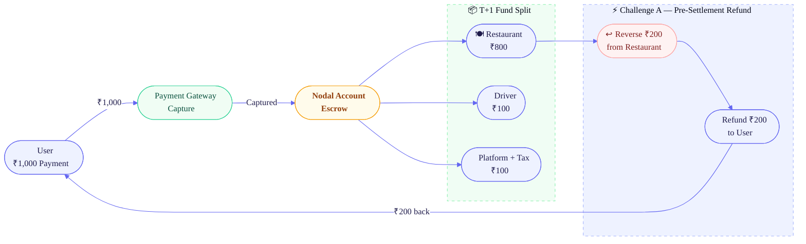
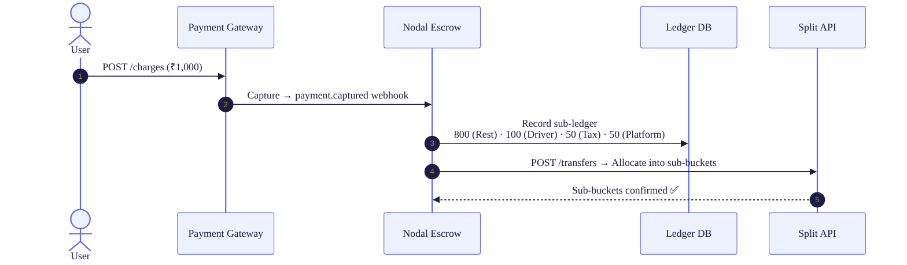
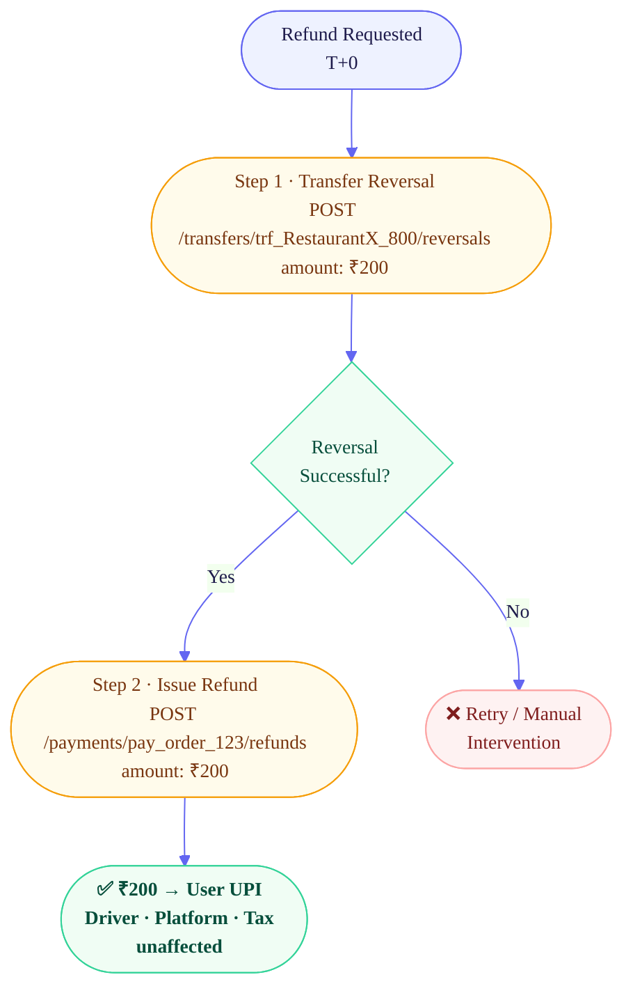
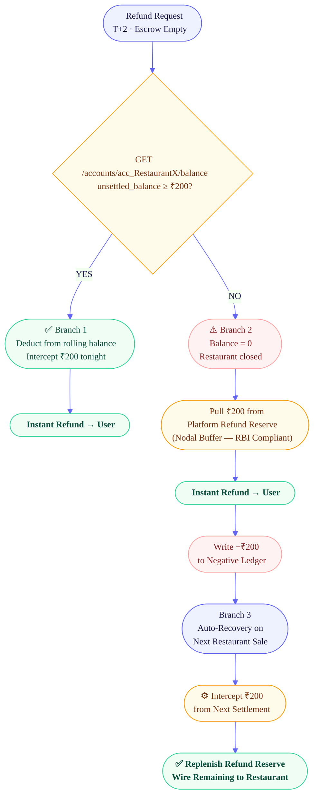

# 💳 Solution Study 01 — Partial Refund with Escrow Reversal & Future Offsetting

---

## 🏗️ Architectural Overview



Two distinct architectural patterns are required depending on **when** the refund is requested relative to the settlement window:

| # | Challenge | Timing | Escrow State | Pattern |
|:-:|:----------|:-------|:-------------|:--------|
| **A** | Pre-Settlement Refund | Same day `T+0` | Funds still in Escrow | **Transfer Reversal** |
| **B** | Post-Settlement Refund | Two days later `T+2` | Escrow is empty | **Future Offsetting + Negative Ledger** |

---

## 🔄 API State Machine — Happy Path (`T+0`)



| Step | Action | Endpoint | Logic |
|:----:|:-------|:---------|:------|
| **01** | **Capture** | `POST /charges` | ₹1k lands in Nodal Escrow. Trigger `payment.captured` webhook. |
| **02** | **Ledger** | `Local DB` | Record sub-ledger: 800 (Rest), 100 (Driver), 50 (Tax), 50 (Platform). |
| **03** | **Split** | `POST /transfers` | Fire split API. Funds allocated into Escrow sub-buckets. |

---

## ⚡ Challenge A — Transfer Reversal (Pre-Settlement)

> **Scenario:** Refund requested **before** `T+1` settlement. Escrow still holds all funds.  
> **Strategy:** Two-step **Atomic Rebalancing** — penalise the restaurant, shield everyone else.



### Step 1 · Targeted Reversal — Penalise the Restaurant

```json
POST /transfers/trf_RestaurantX_800/reversals
{
  "amount": 20000
}
```

> **Result:** Restaurant sub-bucket: `₹800 → ₹600`. The `₹200` returns to the _Unallocated_ pool of the main transaction. Driver's `₹100` remains **untouched**.

### Step 2 · Issue Refund from Rebalanced Main Transaction

```json
POST /payments/pay_order_123/refunds
{
  "amount": 20000
}
```

> **Result:** `₹200` flows back to the user's UPI. Driver, Platform, and Tax are fully shielded.

### T+1 Reconciliation Summary

| Party | Final Payout | Status |
|:------|:------------:|:------:|
| Restaurant | ₹600 | ✅ Wired |
| Driver | ₹100 | ✅ Wired |
| Platform + Tax | ₹100 | ✅ Wired |
| User | −₹200 | ✅ Refunded |
| **TOTAL** | **₹1,000** | ✅ **Balanced** |

---

## 🔥 Challenge B — Future Offsetting + Negative Ledger (Post-Settlement)

> **Scenario:** Two days have passed (`T+2`). Escrow is empty; the restaurant has `₹800` in their Partner Bank account.  
> A blind `Transfer Reversal` will throw `INSUFFICIENT_ESCROW_BALANCE`.

> [!WARNING]
> The Food Platform **cannot** use corporate funds to cover this refund. Wiring `₹200` from the Platform's own Partner Bank current account to the user is **illegal fund co-mingling** under RBI's Payment Aggregator guidelines.

---

### Full Three-Branch Decision Tree



---

### Branch 1 · Deduct from Restaurant's Unsettled Rolling Balance

```http
GET /accounts/acc_RestaurantX/balance
→ { "unsettled_balance": 650 }   // Restaurant sold food today
```

**If `unsettled_balance ≥ ₹200`** → Directly deduct from today's rolling balance. The PA intercepts `₹200` from tonight's settlement, moves it to the refund pool, and refunds the user instantly. ✅

---

### Branch 2 · Platform Refund Reserve (Nodal Buffer)

**Condition:** Restaurant has zero ongoing transactions — nothing to intercept.

> [!IMPORTANT]
> When the Food Platform onboarded with the PA, a **₹5 Crore Dispute & Refund Reserve** was pre-deposited into a _segregated compartment_ of the PA's Nodal Account.

**This is RBI-compliant because it is:**
- Pre-declared to the PA and RBI as a dispute buffer
- **Not co-mingled** with the Platform's operational treasury
- Legally classified as a _"Customer Funds Reserve"_, not corporate capital

```
PA.Refund.PullFromReserve(amount=200, reason="DISPUTE_PARTIAL_REFUND")
→ ₹200 instantly wired to user's UPI  ✅
```

---

### Branch 3 · Negative Ledger + Auto-Recovery Offset

**Record the debt immediately:**

```sql
UPDATE restaurant_ledger
SET    balance   = balance - 200,
       debt_flag = TRUE
WHERE  restaurant_id = 'rest_x';
-- New balance: -₹200
```

**Automated recovery on next sale** _(Restaurant X sells a ₹500 pizza three days later)_:

```
LedgerEngine: restaurant_x.balance = -200
→ Intercept ₹200 from tonight's settlement
→ Replenish Platform Nodal Refund Reserve
→ Wire remaining ₹300 to Restaurant Partner Bank
```

> [!TIP]
> The restaurant is automatically penalised on their **next** settlement. The Refund Reserve is **fully replenished**. The system is **self-healing**.

---

## 📊 Outcome Guarantee — All Branches

| Stakeholder | Outcome | Compliant? |
|:------------|:--------|:----------:|
| **User** | Receives `₹200` refund **instantly** in all scenarios | ✅ |
| **Driver** | Payout fully shielded — never touched | ✅ |
| **Platform + Tax** | Settled normally at `T+1` | ✅ |
| **Restaurant** | Penalised via reversal or next-settlement offset | ✅ |
| **RBI / PA Guidelines** | No fund co-mingling; reserve pre-declared | ✅ |