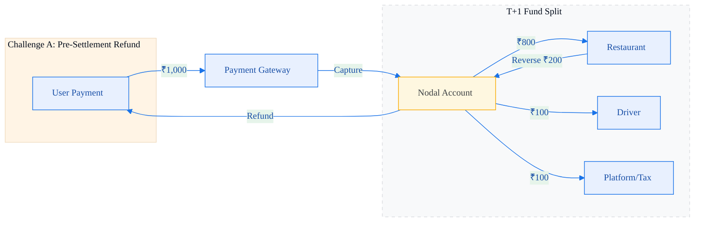

# Solution Study 01: Partial Refund with Escrow Reversal & Future Offsetting

## 🏗️ Architectural Overview



Two distinct architectural patterns are required depending on **when** the refund is requested relative to the settlement window.


| Challenge | Timing | Escrow State | Pattern |
| :--- | :--- | :--- | :--- |
| **A** | Same day (T+0) | Funds still in Escrow | **Transfer Reversal** |
| **B** | Two days later (T+2) | Escrow is empty | **Future Offsetting + Negative Ledger** |

---

## 🔄 API State Machine (Happy Path, T+0)

| State | Action | API Endpoint | Logic |
| :--- | :--- | :--- | :--- |
| **01** | **Capture** | `POST /charges` | ₹1k lands in Nodal Escrow. Trigger `payment.captured` webhook. |
| **02** | **Ledger** | `Local DB` | Record sub-ledger: 800 (Rest), 100 (Driver), 50 (Tax), 50 (Platform). |
| **03** | **Split** | `POST /transfers` | Fire split API. Funds are allocated into Escrow sub-buckets. |

---

## ⚡ Challenge A Solution: Transfer Reversal (Pre-Settlement)

When the refund is requested **before** T+1 settlement, the Escrow still holds all funds. We execute a two-step **Atomic Rebalancing**:

### Step 1: Targeted Reversal — Penalize the Restaurant
```json
POST /transfers/trf_RestaurantX_800/reversals
{
  "amount": 20000
}
```
> **Result**: Restaurant sub-bucket: ₹800 → ₹600. The ₹200 returns to the "Unallocated" pool of the main transaction. Driver's ₹100 remains **untouched**.

### Step 2: Issue Refund from Rebalanced Main Transaction
```json
POST /payments/pay_order_123/refunds
{
  "amount": 20000
}
```
> **Result**: ₹200 flows back to the user's UPI. Driver, Platform, and Tax are fully shielded.

### T+1 Reconciliation (Challenge A)
| Party | Final Payout | Status |
| :--- | :--- | :--- |
| Restaurant | ₹600 | Wired |
| Driver | ₹100 | Wired |
| Platform + Tax | ₹100 | Wired |
| User | -₹200 | Refunded |
| **TOTAL** | **₹1,000** | ✅ **Balanced** |

---

## 🔥 Challenge B Solution: Future Offsetting + Negative Ledger (Post-Settlement)

Two days have passed. The Escrow is empty; the restaurant has ₹800 in their Partner Bank account. A blind `Transfer Reversal` will throw `INSUFFICIENT_ESCROW_BALANCE`.

> [!WARNING]
> The Food Platform **cannot** use corporate funds to cover this refund. Wiring ₹200 from the Platform's own Partner Bank current account to the user is **illegal fund co-mingling** under RBI's Payment Aggregator guidelines.

The system executes a **three-branch decision tree**:

### Branch 1: Check the Restaurant's Unsettled Rolling Balance
```
GET /accounts/acc_RestaurantX/balance
→ { "unsettled_balance": 650 }  // Restaurant sold food today
```
**If unsettled balance ≥ ₹200** → Directly deduct from today's rolling balance. The PA intercepts ₹200 from tonight's settlement to the restaurant, moves it to the refund pool, and refunds the user instantly. ✅

### Branch 2: Unsettled Balance is Zero (Restaurant is Closed)
If the restaurant has no ongoing transactions, there is nothing to intercept.

**Solution: Platform Refund Reserve (Nodal Buffer)**

When the Food Platform onboarded with the PA, we pre-deposited a **₹5 Crore Dispute & Refund Reserve** into a _segregated compartment_ of the PA's Nodal Account. This is **compliant** because it is:
- Pre-declared to the PA and RBI as a dispute buffer.
- Not co-mingled with the Platform's operational treasury.
- Legally classified as a "Customer Funds Reserve," not corporate capital.

```
PA.Refund.PullFromReserve(amount=200, reason="DISPUTE_PARTIAL_REFUND")
→ ₹200 instantly wired to user's UPI.
```

> [!IMPORTANT]
> The user is refunded instantly from the compliant buffer. Churn is prevented.

### Branch 3: Record the Negative Ledger
```sql
UPDATE restaurant_ledger
SET balance = balance - 200, debt_flag = TRUE
WHERE restaurant_id = 'rest_x';
-- New balance: -₹200
```
Restaurant X now carries a **Negative Balance** in the Food Platform's internal ledger.

### The Automated Recovery (Offset)
Three days later, Restaurant X sells a ₹500 pizza. Before T+1 settlement fires, the PA's routing engine queries the ledger:

```
LedgerEngine: restaurant_x.balance = -200
→ Intercept 200 from tonight's settlement.
→ Replenish the Platform's Nodal Refund Reserve.
→ Wire remaining 300 to Restaurant Partner Bank.
```

> [!TIP]
> The restaurant is automatically penalized on their **next** settlement. The Refund Reserve is **fully replenished**. The system is self-healing.

---

## 📊 Full Decision Tree Summary

```
User raises refund request (T+2)
│
├─► [Check PA] Does Restaurant have unsettled funds today?
│       │
│       ├─► YES → Deduct from rolling balance → Instant refund ✅
│       │
│       └─► NO  → Pull from Platform Refund Reserve → Instant refund ✅
│                └─► Write -₹200 to Negative Ledger
│                └─► On next Restaurant sale → Auto-Offset → Reserve replenished ✅
│
└─► [In ALL cases] User receives refund instantly. Driver unaffected. RBI compliant.
```
