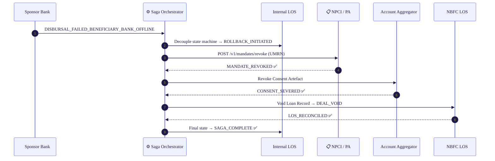
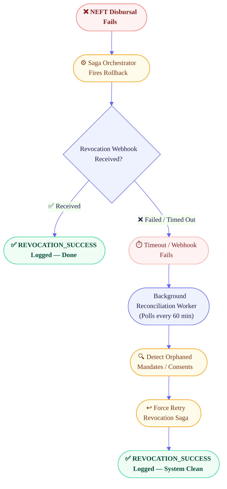

# 🏗️ Architectural Blueprint — 5-Step Compensating Saga Rollback

## 5 Modalities Compliance

| Modality | Status | Why it applies |
|---|---|---|
| Fund Routing | Triggered | The rollback determines whether customer-authorized money can ever be pulled for a loan that failed before disbursal. |
| State Synchronization | Triggered | NPCI, AA, the sponsor bank, and internal LOS state can diverge unless the saga records deterministic rollback receipts. |
| Liability & Risk | Triggered | Zombie mandates and half-open loan records create direct legal, audit, and customer-harm exposure. |
| Data Segregation | Triggered | AA consent must be severed the moment the failed loan no longer has a valid purpose under the data-sharing contract. |
| Graceful Degradation | Triggered | A failed disbursal degrades into a compensating saga plus background reconciliation rather than leaving liabilities open. |

To meet the **30-second underwriting requirement** while adhering to Digital Lending Guidelines (DLG), we architect our 4-step pipeline as a **Distributed Saga**. Traditional ACID transactions are impossible across decoupled ecosystems (AA, NPCI, Core Banking).

> [!IMPORTANT]
> **Key Architectural Decision: The Saga Pattern.**  
> Traditional database transactions cannot span across external APIs (NPCI/AA). By using a **Compensating Saga**, we ensure that when any terminal step fires a failure, the orchestrator triggers inverse transactions backward through every previously succeeded step to maintain state integrity.

---

## 🗺️ System Architecture — Success vs. Rollback

```mermaid
---
config:
  theme: base
  themeVariables:
    primaryColor: "#EEF2FF"
    primaryTextColor: "#1E1B4B"
    primaryBorderColor: "#6366F1"
    lineColor: "#6366F1"
    secondaryColor: "#F0FDF4"
    tertiaryColor: "#FFFBEB"
    edgeLabelBackground: "#FFFFFF"
    fontSize: "15px"
    fontFamily: "'Segoe UI', system-ui, sans-serif"
---
flowchart LR
    subgraph SUCCESS ["✅ 1 · Happy Path"]
        direction LR
        A(["🟢 Start"])
        B(["📋 NPCI\nMandate"])
        C(["🔗 AA\nConsent"])
        D(["🏦 Bank\nNEFT"])
        A --> B --> C --> D
    end

    subgraph ROLLBACK ["🔴 2 · Failure Rollback Saga"]
        direction LR
        E(["⚙️ Orchestrator"])
        F(["↩️ Revoke\nMandate"])
        G(["✂️ Sever\nConsent"])
        H(["🚫 Void\nLoan"])
        E --> F --> G --> H
    end

    D -- "❌ NEFT Fails" --> E

    style A fill:#F0FDF4,stroke:#34D399,color:#064E3B
    style B fill:#EEF2FF,stroke:#6366F1,color:#1E1B4B
    style C fill:#EEF2FF,stroke:#6366F1,color:#1E1B4B
    style D fill:#F0FDF4,stroke:#34D399,color:#064E3B,font-weight:bold
    style E fill:#FEF2F2,stroke:#F87171,color:#7F1D1D,font-weight:bold
    style F fill:#FFFBEB,stroke:#F59E0B,color:#78350F
    style G fill:#FFFBEB,stroke:#F59E0B,color:#78350F
    style H fill:#FEF2F2,stroke:#FCA5A5,color:#7F1D1D
    style SUCCESS fill:#F0FDF4,stroke:#86EFAC,stroke-dasharray:5 5
    style ROLLBACK fill:#FEF2F2,stroke:#FCA5A5,stroke-dasharray:5 5
```



---

## ☠️ The Danger State — The Zombie Mandate

> [!WARNING]
> When **Step 4 (NEFT Disbursal)** fails, the system holds **three live liabilities** that must be proactively killed. Failure to do so creates _"Zombie Mandates"_ — where a user is charged EMIs for a loan that was never successfully disbursed.

| # | Asset | Status | Risk if Ignored |
|:-:|:------|:------:|:----------------|
| 1 | UPI AutoPay Mandate (UMRN) | 🔴 **ACTIVE** | Illegal EMI deduction for a non-existent loan |
| 2 | AA Consent Artefact | 🔴 **ACTIVE** | DPDP Act violation — Purpose Limitation principle |
| 3 | NBFC Loan Record | 🟡 **PROCESSING** | Erroneous retry of disbursal; dirty audit books |

---

## 🔄 The 5-Step Compensating Rollback



---

### Step 1 · State Interception *(Internal)*

The millisecond the `DISBURSAL_FAILED_BENEFICIARY_BANK_OFFLINE` webhook arrives from the Sponsor Bank, the internal LOS state machine **decouples**.

---

### Step 2 · Mandate Revocation *(NPCI via Payment Aggregator)*

> [!IMPORTANT]
> **Mandate Revocation is Mandatory.**  
> Leaving a mandate alive on a failed loan is a primary driver of RBI Ombudsman complaints. The system must kill the UMRN programmatically.

```json
POST /v1/mandates/revoke
{
  "umrn": "NPCI1234567890ABCD",
  "reason_code": "LOAN_DISBURSAL_FAILURE"
}
```

---

### Step 3 · Consent Artefact Revocation *(Account Aggregator)*

> [!WARNING]
> **Regulatory Trap — DPDP Act Violation.**  
> Retaining data access after a loan rejection violates the **Purpose Limitation** principle. Data-sharing must be severed the moment the transaction is void.

---

### Step 4 · NBFC LOS Reconciliation *(DLG Compliance)*

The NBFC's Loan Origination System must be explicitly informed the entire deal is void — preventing any automated retry logic from re-firing the NEFT disbursal.

---

## 🔥 Nightmare Edge Case — The Async Failure



> [!CAUTION]
> **Nightmare Scenario:** The Disbursal fails, but the **revocation receipts time out**. The user can now have an active mandate and/or a still-live AA consent despite a cancelled loan. The system must implement a **Background Reconciliation Worker** that polls every 60 minutes for orphaned mandates **and orphaned consents**, then retries the relevant revocation call until both receipts are logged.

### Extending the Worker to AA Consent Timeouts

The worker should maintain a single orphan-liability queue keyed by `loan_id`, with both the `umrn` and `consent_handle_id` attached:

- If mandate revocation is missing, retry `POST /v1/mandates/revoke` until an authoritative `MANDATE_REVOKED` receipt arrives.
- If consent severance is missing, retry the AA consent revocation until `CONSENT_SEVERED` is logged.
- The saga only reaches `SAGA_COMPLETE` after **both** liabilities are neutralized and the NBFC LOS is voided.

---

## 🏆 Why This Architecture Wins

This Saga rollback demonstrates three pillars of production-grade lending infrastructure:

| # | Pillar | What It Proves |
|:-:|:-------|:---------------|
| **1** | 🧹 **System Hygiene** | No orphaned database records across any participant |
| **2** | 🛡️ **Regulatory Empathy** | Proactively protects the consumer via mandate and consent revocation |
| **3** | 🌐 **Ecosystem Breadth** | Clean rollback orchestrated across **NPCI**, **Sahamati AA**, and the **NBFC LOS** |
