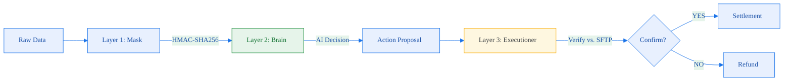

# The Solution: The EOD Convergence Barrier

This represents the ultimate intersection of AI, legacy banking, and operational reality. When dealing with a 1990s system, you cannot rely purely on webhooks and real-time APIs.

> [!IMPORTANT]
> **Key Architectural Decision: The Legacy Bridge.** An AI agent is only as good as its data. In Indian FinTech, "Truth" often lives in offline SFTP batches, not real-time JSON APIs. This architecture uses a **Deterministic Executioner** to pause AI decisions until the "Offline Truth" (SFTP Batch) is verified.

---

## ⚡ Step 1: Architecting the "Asynchronous File Drop"

> [!WARNING]
> **Regulatory Trap: The T+1 Refund TAT.** RBI mandates strict timelines for returning failed transaction funds. If the API is offline, a junior system might trigger a refund immediately to satisfy the TAT — only for the Biller to process the payment offline later, leading to **double-loss (Success + Refund)**.

- **The Fallback Truth:** A CSV export of the Biller's internal ledger is dropped into a secure SFTP server at 2:00 AM. This is the ultimate source of truth.

---

## 🔄 Step 2: Modifying the Executioner (Layer 3)

When the LLM outputs `{"suggested_action": "REFUND_TO_USER"}` because the API is dead, the Executioner intercepts.

- **The "Hold" State:** The Executioner shifts the transaction to `PENDING_BATCH_RECON`. It deliberately delays execution, explicitly waiting for the upcoming 2:00 AM SFTP file drop.

---

## 🏗️ Step 3: Secondary AI Batch Parsing (2:00 AM)

> [!CAUTION]
> **Data Privacy Trap: DPDP Act Compliance.** We cannot pass the raw SFTP CSV (containing Phone Numbers, Names, and Unit IDs) to a third-party LLM. The system must perform ** HMAC-SHA256 Tokenization** at the edge before the AI agent performs the reconciliation analysis.

### The Automated Recovery
1. **Match Found (Success):** The system realizes the Biller *did* update their ledger offline. Settlement proceeds. Crisis averted.
2. **Match NOT Found (Failure):** The system has 100% certainty. The Executioner confidently fires the `/refund` API well before the RBI T+1 deadline.

---

## 📊 The Architect's Takeaway
This is how you build FinTech tools for India. You don't just build modern APIs; you build **bridges to legacy systems**. An AI that assumes modern API reliability will haemorrhage money. An AI wrapped in a deterministic Executioner creates a bulletproof, Zero-Trust ledger.

