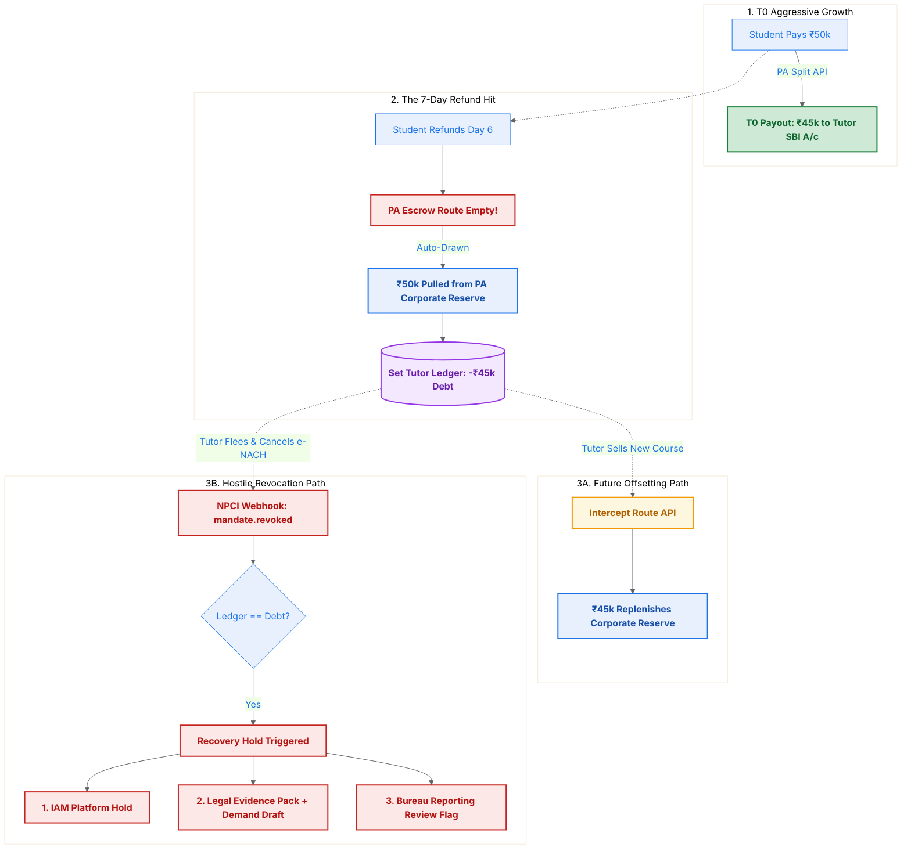

# The Solution: Nodal Reserves & Future Offsetting

## 5 Modalities Compliance

| Modality | Status | Why it applies |
|---|---|---|
| Fund Routing | Triggered | T0 payouts, reserve-backed refunds, future offsets, and e-NACH recovery all move different pools of money with different legal owners. |
| State Synchronization | Triggered | Payout, refund, future sale, aging, and `mandate.revoked` webhook timing determine which recovery path is still available. |
| Liability & Risk | Triggered | The reserve, tutor debt, and enforcement policy explicitly define who fronts the liquidity gap and how it is recovered. |
| Data Segregation | Partial | Reserve funds, platform revenue, and tutor liabilities are isolated even though privacy is not the central challenge in this case. |
| Graceful Degradation | Triggered | Recovery degrades from future offsetting to forced auto-debit and finally to hostile revocation enforcement. |

To empower the CEO's aggressive marketing strategy (T0 Payouts + 7-Day Refunds) without exposing the corporate treasury to an infinite unrecoverable bleed, we discard simple physical route transfers and implement a **Closed-Loop Reserve Architecture**.

This architecture operates on the principle that the platform assumes *temporary* liquidity risk entirely backed by algorithmic recovery.

## Layer 1: The Pre-Funded Nodal Reserve
Instead of the business bleeding capital directly from an active corporate account, we isolate the risk using a Payment Aggregator Nodal feature.
- We allocate a fixed risk budget (e.g., ₹10 Lakhs) from the ICICI corporate treasury and park it entirely within a dedicated **"Refund Reserve"** bucket inside the Razorpay Nodal Escrow.
- **The Instant Refund Execution:** On Day 6, when a student triggers a ₹50,000 refund, the API does not error out due to insufficient funds. It automatically draws the deficit from the Pre-Funded Reserve bucket, fulfilling the 7-Day marketing promise.

## Layer 2: The Negative Ledger & Future Offsetting
SkillX has now successfully refunded the student without delaying the payout to the Tutor, but SkillX is short ₹45,000. 

- **The Ledger Trap:** Simultaneously with the API refund trigger, our internal Database Ledger sets the Tutor's operational balance to an active debt state: `Balance: -₹45,000`.
- **The Magic of Interception (Offsetting):** The following week, the same Tutor successfully sells a new ₹50,000 course to a *different* student.
- At checkout, our Custom Routing Engine queries the Ledger. It detects the negative balance. Instead of routing the new ₹45,000 to the Tutor's bank account, the API payload **intercepts the physical cash**. 
- The ₹45,000 is routed directly back into the Platform's Pre-Funded Refund Reserve bucket. The debt is settled, the reserve is replenished, and the Tutor receives ₹0 for that specific transaction.

SkillX has achieved rapid T0 growth, fully automated its refunds, and eliminated the need for the Finance team to manually invoice or chase Tutors. 

---

## 🛑 The Fatal Flaw (The Doomsday Edge Case)

A Junior PM stops at Layer 2. But adhering to **Modality 3 (The Cost of Failure)** requires us to ask the Doomsday Question:

> *"What if a bad-actor Tutor sells 10 courses on Day 1, cashes out ₹4.5 Lakhs instantly, all 10 students refund on Day 6, and the Tutor uninstalls the app and abandons the platform forever?"*

Because the Tutor never sells on the platform again, **Future Offsetting equals zero**. The Pre-Funded Reserve is drained and never replenished.

## Layer 3: The Ultimate Guardrail (e-NACH Settlement)
We must implement a final physical boundary before the product is allowed to launch. 

We alter the onboarding flow. Before any Tutor is permitted to activate the *“T0 Instant Payout”* feature, the system forces them to execute an **e-NACH (NetBanking AutoPay) Mandate** through their bank during KYC. 

**The Automated Fallback:**
If a Tutor's internal ledger stays negative (`-₹45,000`) for more than 15 consecutive days, Future Offsetting is marked as a failure.
The State Machine transitions the debt to forced recovery and fires an automated webhook to NPCI. We legally auto-debit the ₹45,000 directly from the Tutor's personal SBI bank account (leveraging the mandated e-NACH permission) and transfer it directly back to the platform treasury.

---

## 💥 The Malicious Threat: Active e-NACH Revocation

A true Architect does not just design for the "Sad Path"; they design for the **Malicious Path**. 

**The Million-Dollar Doomsday Question:**
> *"What if the Tutor realizes they owe ₹45,000 and simply opens their ICICI iMobile or GPay app and aggressively taps 'Cancel e-NACH Mandate' on Day 10? Under NPCI rules, consumers have the legal right to revoke a mandate at any time. We cannot block them."*

If the mandate is gone, the 15-day auto-debit fallback fails. The Tutor steals the money. 

### Layer 4: The "Hostile Revocation" Protocol
As Architects, when we cannot physically prevent a consumer right (mandate cancellation), we build a system that ruthlessly penalizes the abuse of that right using automated webhooks and Indian financial law.

Here is the ultimate State Machine extension:

**1. The Webhook Interception**
The millisecond the Tutor successfully cancels the mandate in their banking app, NPCI fires a `mandate.revoked` webhook to our Payment Aggregator, which instantly routes to our backend. 

**2. The Logic Gate (Zero-Trust Ledger Check)**
The system intercepts the webhook and analyzes the Tutor's ledger state:
- If `Ledger Balance >= ₹0`: The system safely acknowledges the cancellation.
- If `Ledger Balance < ₹0` (e.g., `-₹45,000`): The system triggers the **Hostile Revocation Protocol**.

**3. The Automated Recovery Hold (Business & Compliance)**
Because the Tutor severed a financial recovery channel while holding active debt, the system fires an immediate containment workflow and opens a compliance review trail:

- **The Platform Hold:** A webhook hits the internal IAM. The Tutor cannot withdraw pending balances or launch new cohorts until the negative ledger is cleared.
- **The Legal Review Trigger:** The system generates a timestamped evidence pack and demand-notice draft for counsel / compliance review. It does not claim automatic criminal liability merely because a mandate was revoked.
- **The Credit-Bureau Review Flag:** The profile is marked for bureau-reporting eligibility review only if the debt remains unpaid after the contractual cure period and the platform has the required consent, dispute process, and reporting basis.

**The Closing Argument:**
We cannot physically stop a Tutor from tapping "Cancel" on their phone. But this architecture ensures the platform stops new exposure immediately, preserves evidence, opens a recovery path, and routes any legal / bureau action through a controlled review instead of an irreversible automated punishment.
