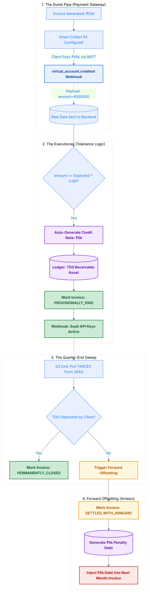

# The Solution: Dynamic Tolerance & Forward Offsetting

To prevent enterprise downtime while ensuring we don't expose the platform to generalized short-payments, we mathematically bind the PA Virtual Accounts to the statutory tax parameters.

---

## Layer 1: The "Dumb Pipe" Reality & Tolerance Bands
The Indian banking network (NEFT/RTGS) is a "dumb pipe" that only speaks money. It does not send metadata about taxes. 
When a client short-pays to account for TDS, the `virtual_account.credited` webhook hits our server entirely bare: `amount: 4500000` (in paise).
We do not configure the Payment Aggregator to physically enforce complex tax boundary logic. Instead, our **Internal State Machine** applies the business rules.

When the raw webhook arrives, the logic evaluates the "Tolerance Band":
`IF received_amount == (expected_amount * 0.90)`

## Layer 2: The BBPS-Style Provisional State
Because the mathematical delta matches a perfect 10% statutory TDS deduction, the system shifts the Invoice into a highly specific holding state: `PROVISIONALLY_PAID`.

Simultaneously, the ERP engine makes an internal execution:
1. It records a **Credit Note** for ₹5,000 against the invoice under the bucket: *“TDS Receivables (Asset).”*
2. Most importantly, it fires a critical internal webhook to the SaaS platform: `invoice.provisionally_paid`.
3. The SaaS platform receives this webhook and keeps the enterprise API keys active. The client experiences zero downtime.

To legally close out this ledger entry, the system automatically emails the client's finance team, requesting the upload of their Form 16A TDS certificate by the end of the quarter.

## Layer 3: The Reality of Government IT & Forward Offsetting
What if a client short-pays by ₹45,000 claiming "TDS" but never actually deposits that ₹5,000 with the government? We must sweep the system at the end of the fiscal quarter.

Our cron-job queries the government TRACES portal (Form 26AS API loop). 
If the ₹5,000 tax deposit does not show under the platform's PAN, the client has functionally underpaid.

### The Architect's Polish: Why we don't Suspend Access
We *could* instantly suspend their API keys when the government portal check fails. But Government IT is notoriously slow. Often, honest clients cannot upload their specific tax certificates in time. Punishing a major Enterprise client for a government downtime issue is poor product design.

Instead of suspending the software, we deploy **Forward Offsetting (Arrears)**.
- The original invoice state shifts from `PROVISIONALLY_PAID` to `SETTLED_WITH_ARREARS`. (Their SaaS remains active).
- A background routine triggers, creating a specific ₹5,000 "Unverified TDS Penalty" ledger entry.
- The next month's standard ₹50,000 invoice is dynamically injected with this arrears line item. The client receives a bill for **₹55,000**.

If the client later provides the manual certificate, the system wipes the generic debt. 

**Conclusion:** We automated the financial variance preventing unearned downtime at T0, validated compliance at T+90 using external sweeps, and protected platform revenue using forward-injecting arrears without ever forcing a human to manually intervene.
