# The Solution: Scoped API Escrows & UPI AutoPay

## 5 Modalities Compliance

| Modality | Status | Why it applies |
|---|---|---|
| Fund Routing | Triggered | DLG compliance depends entirely on principal flowing straight between NBFC escrow, borrower, and collections rails without touching the LSP treasury. |
| State Synchronization | Triggered | AutoPay outcomes, VPA webhooks, and retry timers must converge on one authoritative loan ledger row. |
| Liability & Risk | Triggered | Failed pulls, overdue states, and late fees define the real delinquency exposure of the lending product. |
| Data Segregation | Partial | Principal never co-mingles with the LSP, and fallback VPAs scope reconciliation metadata to a single loan instance. |
| Graceful Degradation | Triggered | Collections degrade from AutoPay to retries to Smart Collect and then to overdue handling instead of collapsing into manual ambiguity. |

To achieve 100% automation while maintaining airtight compliance with the RBI Digital Lending Guidelines (DLG), we throw away the CSV files and the static QR codes. We construct a **Closed-Loop API Ledger** using heavily restricted Payment Aggregator architecture.

```mermaid
%%{init: {'theme': 'base', 'themeVariables': { 'primaryColor': '#E8F0FE', 'primaryBorderColor': '#1A73E8', 'primaryTextColor': '#1A73E8', 'lineColor': '#5F6368', 'fontFamily': 'Inter, Arial'}}}%%
graph TD
    classDef nodal fill:#E8F0FE,stroke:#1A73E8,stroke-width:2px,color:#174EA6,font-weight:bold
    classDef success fill:#CEEAD6,stroke:#188038,stroke-width:2px,color:#0D652D,font-weight:bold
    classDef danger fill:#FCE8E6,stroke:#C5221F,stroke-width:2px,color:#B31412,font-weight:bold
    classDef warning fill:#FEF7E0,stroke:#F29900,stroke-width:2px,color:#B06000,font-weight:bold
    classDef ledger fill:#F3E8FD,stroke:#9334E6,stroke-width:2px,color:#681DA8,font-weight:bold

    subgraph "Part 1: The Disbursal (Scoped Pay-Outs)"
        A[SwiftCred AI Approves Loan] --> B{LSP Triggers Payout API}
        B --> C[RazorpayX Escrow API]:::nodal
        C -->|Validates Scoped IAM Key| D[NBFC Escrow Account Debited]:::nodal
        D -->|Instant IMPS Routing| E[₹20k Touches Student Bank A/C]:::success
    end

    subgraph "Part 2: The Collection (100% Automated Pay-Ins)"
        F[EMI Due: ₹2000] --> G{Collection Method}

        G -->|Manual Catchup| H[Smart Collect Virtual VPA]:::warning
        H --> I[Student Scans Dynamic QR<br/>'swiftcred.L123@razorpay']

        G -->|The Holy Grail| J[UPI AutoPay Mandate]:::success
        J --> K[System Auto-Pulls from NPCI]

        I --> L[NBFC Escrow Account Credited]:::nodal
        K --> L

        L --> M[Webhook: amount+VPA sent to LSP]
        M --> N[(LSP DB: Mark Loan L123 as PAID)]:::ledger
    end
```

---

## Part 1: Instant Disbursals (RazorpayX Escrow APIs)
We discard the 5:00 PM CSV upload entirely.

To satisfy the DLG mandate, we instruct the NBFC to open a dedicated **API Escrow Account** (e.g., RazorpayX).
The NBFC legally retains ownership of the escrow and the capital within it. However, the NBFC generates a specific set of **Scoped IAM (Identity and Access Management) Keys**. These API keys are tightly restricted strictly to *"Payouts Only."* The NBFC hands these scoped keys to SwiftCred.

**The State Machine:**
1. At 2:00 AM, SwiftCred's AI approves a borrower's KYC.
2. SwiftCred's backend fires a `payout.create` API call using the Scoped Key.
3. The API validates the key, debits the physical cash out of the NBFC's Escrow, and executes an instant IMPS transfer to the student.
4. The student receives the funds within seconds, 24/7. **Zero manual intervention, zero co-mingling.**

## Part 2: Zero-Touch Collections (Reconciliation)
We discard the generic static QR code that creates anonymous data black holes. We replace it with determinism.

Whenever a borrower's EMI is due, SwiftCred employs two distinct solutions depending on the user's intent path:

### Attempt A: The Enterprise Holy Grail (UPI AutoPay)
During the initial loan onboarding phase (before the student even receives the ₹20k disbursal), our state machine forces the student to sign a **UPI AutoPay Mandate**.

On the 5th of every month, SwiftCred doesn't ask the borrower to open an app. The state machine silently triggers a pull request against the NPCI switch. The NPCI auto-debits the student's bank account, routing the physical capital straight into the NBFC Escrow. SwiftCred's internal ledger is marked `PAID`.

### Attempt B: The Manual Fallback (Smart Collect Virtual VPAs)
If the AutoPay mandate fails (insufficient funds) or the student prefers manual payment, SwiftCred falls back to **Smart Collect**.

Instead of texting a generic QR code, SwiftCred's backend hits an API to generate a temporary, highly specific Virtual Account wrapped in a Dynamic VPA.
- **Example VPA:** `swiftcred.loan9876@razorpay`

When this VPA is rendered on the student's phone, it is strictly hardcoded to accept only ₹2,000.

**The Automated Webhook Reconciliation:**
When the student pays the Virtual VPA, the capital bypasses SwiftCred and lands natively in the NBFC Escrow. A millisecond later, the Payment Aggregator fires a `virtual_account.credited` webhook to SwiftCred's servers.
The payload does not contain an anonymous UTR; it inherently contains `reference_id: loan9876`.

SwiftCred's backend strips the ID, updates the exact row in the database, and flips the ledger state to `PAID`. The finance team's 80-hour reconciliation spreadsheet is permanently eliminated.

### Failure Branch: `mandate.failed` -> Retry -> VPA -> Late Fee

The missing Sad Path is the collections engine that runs *after* AutoPay fails:

| Stage | State Transition | System Action |
|---|---|---|
| 1 | `AUTO_PAY_DUE -> MANDATE_FAILED` | NPCI returns `mandate.failed` because the borrower bank balance is insufficient. |
| 2 | `MANDATE_FAILED -> RETRY_SCHEDULED` | The collections engine schedules deterministic retries before escalating to manual rails. |
| 3 | `RETRY_SCHEDULED -> VPA_FALLBACK_OPEN` | If retries still fail, Smart Collect generates a loan-scoped fallback VPA and QR. |
| 4 | `VPA_FALLBACK_OPEN -> PAID` | A successful `virtual_account.credited` webhook closes the EMI with exact loan metadata. |
| 5 | `VPA_FALLBACK_OPEN -> OVERDUE` | If the fallback rail is also unpaid, the ledger marks the installment overdue and injects the lender's late-fee line item. |

This keeps the collection engine explicit: first try silent pull, then controlled retry, then deterministic manual payment, and only then delinquency pricing.
