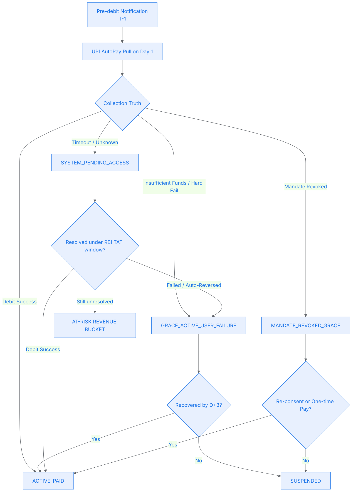
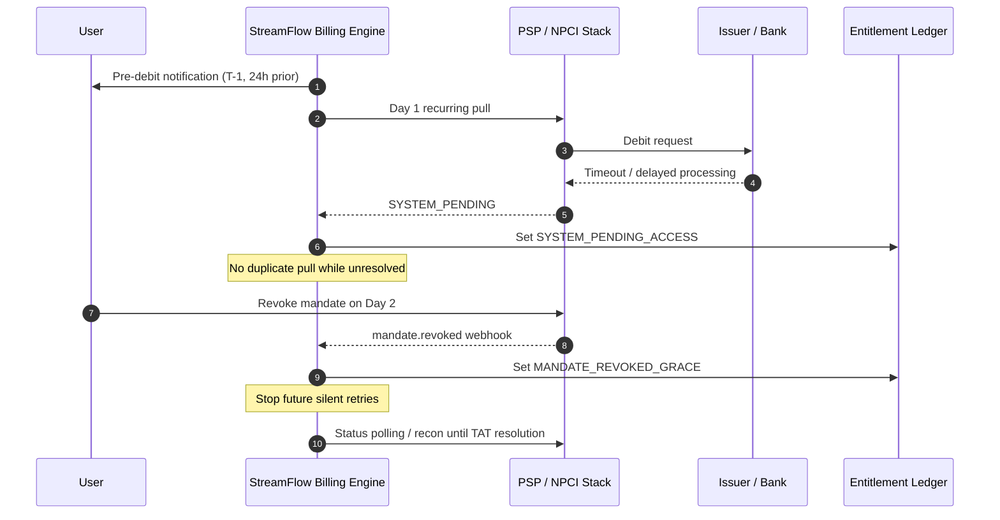

# The Solution: Dual-Clock Grace Ledger & Resolution Barrier

## 5 Modalities Compliance

| Modality | Status | Why it applies |
|---|---|---|
| Fund Routing | Triggered | StreamFlow only earns ₹999 after the issuer-side debit is actually completed; grace cannot masquerade as collected revenue. |
| State Synchronization | Triggered | Timeouts, delayed bank processing, revocations, and auto-reversal windows create multiple competing “truths” for the same renewal cycle. |
| Liability & Risk | Triggered | Every grace-day is unsecured recurring-revenue exposure that must be quantified and capped. |
| Data Segregation | Partial | Entitlement, mandate health, and collections truth must be separated so the product surface never acts on raw PSP noise. |
| Graceful Degradation | Triggered | The billing engine must degrade from silent AutoPay to controlled retries, manual recovery, and suspension without double-debiting. |

> [!IMPORTANT]
> **Key Architectural Decision:** A grace period is not a payment state. It is an **entitlement state backed by an explicit exposure ledger**. Payment truth continues to live in the collections ledger until a deterministic receipt or failed-transaction resolution is available.

---

## 1. RBI Ground Truth Before Product Logic

This architecture is built around four regulatory anchors:

1. **UPI e-mandates fall under the RBI e-mandate framework**
   RBI extended the recurring e-mandate framework to UPI on **January 10, 2020**.
2. **Pre-debit notification is mandatory**
   The e-mandate framework requires the issuer to send a **pre-debit notification at least 24 hours prior to the actual charge / debit**.
3. **Mandate revocation is a legitimate customer action**
   The framework explicitly supports customer withdrawal / revocation of the mandate.
4. **Failed merchant-payment timelines are separately regulated**
   RBI's failed-transaction TAT framework distinguishes unresolved merchant-payment failures from customer-fault states. For debit-confirmed merchant-payment failures, auto-reversal can run to `T+5`, which is longer than StreamFlow's `D+3` commercial grace promise.

### The Key Product Consequence

The ₹999 subscription is **below the standard ₹15,000 AFA-waiver threshold for subsequent recurring debits**, so this is **not** an OTP-friction problem. RBI's later ₹1 lakh relaxation is limited to specified categories such as mutual funds, insurance premiums, and credit card bill payments; it does not change this video-subscription flow.

It is a **post-initiation resolution problem**:
- Did the debit happen?
- Is the debit still in flight?
- Did the bank fail?
- Did the user fail?
- Did the user revoke the mandate after the request was already handed off?

If those are not separated, the ledger is fiction.

---

## 2. The Four-Ledger Split

The platform should never drive entitlements directly from PSP callbacks. It should maintain four explicit ledgers:

| Ledger | Purpose | Example fields |
|---|---|---|
| **Collections Attempt Ledger** | Source of payment truth | `attempt_id`, `subscription_id`, `mandate_id`, `attempt_state`, `resolution_source` |
| **Entitlement Ledger** | What the product surface reads | `ACTIVE_PAID`, `SYSTEM_PENDING_ACCESS`, `GRACE_ACTIVE_USER_FAILURE`, `SUSPENDED` |
| **Grace Exposure Ledger** | Quantifies unsecured revenue | `at_risk_amount`, `grace_started_at`, `grace_expiry_at`, `risk_bucket` |
| **Mandate Health Ledger** | Tracks the silent recovery rail | `ACTIVE`, `PENDING`, `REVOKED`, `RECONSENT_REQUIRED` |

This is the "Shock Absorber."

The user can watch content because of the **Entitlement Ledger**.
Finance can still see that no cash has arrived because the **Collections Attempt Ledger** remains unresolved.

---

## 3. The State Sync Nightmare: Distinguish Bank Failure from User Failure

The 50,000 timeout cohort must **not** be treated as a generic failed renewal cohort.

### Correct Classification

| Bucket | Trigger | What it means | Next action |
|---|---|---|---|
| `DEBIT_SUCCESS` | Final success receipt | Revenue is earned | Close cycle as paid |
| `USER_FAILURE` | Hard fail, insufficient funds, explicit debit decline | Customer-side recovery needed | Open `D+3` commercial grace |
| `SYSTEM_PENDING` | Timeout, missing confirmation, ambiguous in-flight status | Payment truth unresolved | Park under RBI resolution clock |
| `PLATFORM_FAILURE` | Pull never actually initiated | Merchant-side failure | Do not blame user; isolate leakage separately |

### Non-Negotiable Rule

> **Do not fire a second AutoPay pull while the first pull is unresolved.**

If the timeout cohort is blindly retried, the platform creates a double-debit risk once the delayed bank leg settles.

### Why This Matters

- **Bank A delay** is not user intent.
- **NPCI / PSP timeout** is not proof of failure.
- **User revocation on Day 2** changes future recovery rights, but does not retroactively prove that Day 1 was unpaid.

That means `SYSTEM_PENDING` is its own first-class state.

---

## 4. The Dual-Clock Model

The architecture runs two separate clocks:

### Clock 1 — Commercial Grace Clock
Used only for `USER_FAILURE`.

- starts immediately on hard fail
- expires at `D+3`
- allows controlled retries and one-time recovery links

### Clock 2 — RBI Resolution Clock
Used only for `SYSTEM_PENDING`.

- starts when the renewal request becomes ambiguous
- continues until the system receives a final success / failure / reversal truth under the failed-transaction framework
- **does not allow another silent pull** against the same billing cycle while unresolved

This is the product trade-off:
- **User Experience:** keep service live when system truth is unresolved
- **Revenue Security:** classify exposure explicitly and cap it as platform risk

---

## 5. The Grace Exposure Ledger

The grace design fails unless the platform quantifies the temporary unsecured revenue.

### Required State Machine

| Entitlement State | Meaning | Ledger consequence |
|---|---|---|
| `ACTIVE_PAID` | Renewal confirmed | Revenue booked |
| `GRACE_ACTIVE_USER_FAILURE` | Customer-side recovery window is open | `₹999` at-risk receivable |
| `SYSTEM_PENDING_ACCESS` | System truth unresolved | `₹999` in unresolved platform-risk bucket |
| `MANDATE_REVOKED_GRACE` | Silent recovery rail is gone | `₹999` exposed and non-renewable without user action |
| `RECOVERED_WITHIN_GRACE` | Payment recovered before expiry | Exposure cleared |
| `SUSPENDED` | Recovery failed / user non-adoption | Entitlement removed |

### Why the Ledger Must Exist

Without a dedicated exposure ledger:
- product reports “active users”
- finance assumes “earned revenue”
- collections reports “pending”
- risk cannot quantify leakage

That is exactly how grace becomes permanent deficit.

---

## 6. Hostile Revocation Prevention: Treat Revocation as an Adoption Signal

Revocation during grace is not just a mandate event. It is a **high-confidence churn signal**.

### When `mandate.revoked` Arrives During Grace

1. **Stop all silent retries immediately**
   The recovery rail is legally gone.
2. **Reclassify the account to `MANDATE_REVOKED_GRACE`**
   This is distinct from both `USER_FAILURE` and `SYSTEM_PENDING`.
3. **Freeze future auto-renew eligibility**
   The account becomes `non_renewable` until the user re-consents.
4. **Offer only two recovery rails**
   - one-time manual payment
   - fresh mandate setup
5. **Suspend at expiry if neither action occurs**
   No soft-extension beyond the grace commitment.

### The Important Nuance

If the Day 1 pull is still unresolved when revocation happens on Day 2:
- future silent retries must stop immediately
- but the current cycle must still be reconciled to final truth before the platform requests another payment

Otherwise, the platform may charge manually while the original pull settles later.

---

## 7. Trade-off Table: UX vs Revenue Security

| Decision | UX Benefit | Revenue / Risk Cost | Final Choice |
|---|---|---|---|
| Give 3-day grace to all failures | Fewer immediate suspensions | Massive free-service leakage | Rejected |
| Retry unresolved timeouts immediately | Faster recovery in some cases | Double-debit risk | Rejected |
| Suspend all timeouts at D+3 | Limits exposure | False suspensions while debit truth is unresolved | Rejected |
| Separate `USER_FAILURE` from `SYSTEM_PENDING` | Cleaner recovery logic | Higher ledger complexity | Selected |
| Treat revocation as churn signal | Earlier risk response | More explicit entitlement transitions | Selected |

---

## 8. Success Metric: Protect the North Star

The primary product metric is:

**Net Successful Recurring Revenue Rate**
`= collected recurring MRR / scheduled recurring MRR`

But this architecture must also monitor the following guardrails:

| Metric | What it tells us |
|---|---|
| **Grace Recovery Rate** | How much grace-period MRR is recovered before suspension |
| **System Pending Exposure** | How much unresolved recurring MRR is being floated due to timeout ambiguity |
| **Unknown Resolution SLA** | How quickly timeout cohorts reach deterministic truth |
| **Mandate Revocation During Grace %** | Whether the “pending” experience is driving active churn behavior |
| **Double-Debit Incident Rate** | Whether retries are being fired before original attempts are fully resolved |
| **False Suspension Rate** | Whether the entitlement engine is still punishing users for system-side ambiguity |

### The Operating Goal

If this system is healthy:
- involuntary churn falls
- double-debit incidents trend toward zero
- unresolved timeout cohorts clear quickly
- revoked mandates convert into re-consent or manual pay before grace expiry
- at-risk recurring revenue remains visible and capped, not hidden inside “active subscriber” vanity metrics

---

## 9. The Architect's Takeaway

This case proves a brutal Indian-fintech truth:

> A recurring mandate is not a promise of revenue. It is only a **permission to attempt collection**.

The real product problem is not “should we give grace?”

It is:
- what truth do we have,
- what truth do we still lack,
- and how much recurring revenue are we deliberately floating while we wait for the banking system to catch up?

That is why StreamFlow needs a **Dual-Clock Grace Ledger**, not a friendly-looking `PAYMENT_PENDING` badge.

---

## 10. Interactive Prototype

This case ships with the same runnable demo structure as the rest of the repository:

- `src/index.html` renders the browser-playable terminal simulation.
- `src/mock_api.js` exports `runScenario`, `resetState`, `SCENARIOS`, and `STATE_CONSTANTS` for headless Node checks.

The prototype covers four paths:

- `system_pending_success`: timeout held behind the resolution barrier, then settled.
- `user_failure_recovered`: deterministic insufficient funds recovered inside `D+3`.
- `unresolved_suspended`: unresolved system-pending attempt expires without success.
- `mandate_revoked`: revocation during grace blocks silent retries and forces re-consent / one-time payment.

---

## 11. RBI Reference Anchors

The regulatory claims in this case map to the following RBI publications:

1. **UPI recurring e-mandates brought under the framework**
   https://www.rbi.org.in/scripts/NotificationUser.aspx?Id=11784
2. **Recurring-transactions framework including pre-debit notification and withdrawal facility**
   https://www.rbi.org.in/Scripts/BS_CircularIndexDisplay.aspx?Id=12051
3. **AFA-waiver ceiling increased to ₹15,000 for subsequent recurring debits**
   https://www.rbi.org.in/scripts/NotificationUser.aspx?Id=12341
4. **Category-specific AFA relaxation to ₹1 lakh for mutual funds, insurance premiums, and credit card bill payments**
   https://www.rbi.org.in/scripts/NotificationUser.aspx?Id=12570
5. **Pre-debit notification requirement reaffirmed for recurring e-mandates**
   https://www.rbi.org.in/scripts/FS_Notification.aspx?Id=12722
6. **Failed-transaction TAT and auto-reversal framework for authorised payment systems**
   https://www.rbi.org.in/commonman/Upload/English/Notification/PDFs/CIRCULAR677EC931A7A65E4D99AA957D8E85BC0A2A.PDF
